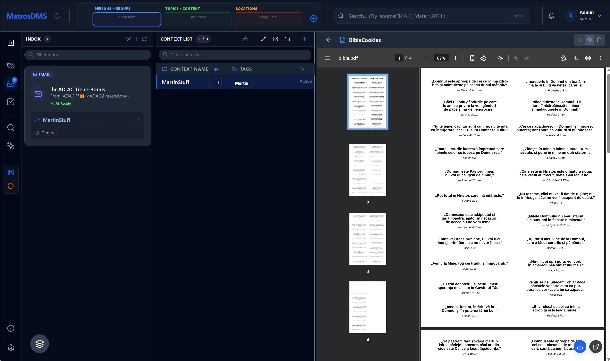

# MatrosDMS

> **Your documents. Your folders. Your rules.**  
> A privacy-first, open-source Document Management System that combines the familiarity of folders with the power of smart tagging.

[](LICENSE)
[](https://openjdk.org/)
[](https://vuejs.org/)

---

## 📸 Overview


*MatrosDMS interface showing hierarchical context navigation and document timeline*

---

## 🤔 Why MatrosDMS?

MatrosDMS organizes documents the way you think — using **Who**, **What**, and **Where**. Pick a context once, drop files in, and everything is automatically tagged and searchable. No per-file labeling. Just a clean timeline for every combination.

**100% Local. Zero Cloud. Full Control.**

---

## ✨ Key Features

### 📂 Hierarchical Context Navigation

Select your context using three drop zones — everything you add inherits these tags automatically:

```
┌─────────────────────┬─────────────────────┬─────────────────────┐
│  PERSONS / GROUPS   │  TOPICS / CONTENT   │     LOCATIONS       │
│  ┌─────────┐        │                     │                     │
│  │ Mihaela ✕│       │     Drop here       │     Drop here       │
│  └─────────┘        │                     │                     │
└─────────────────────┴─────────────────────┴─────────────────────┘
```

**Example:** Select `Mihaela` → `Tax Report` → `Tax Office`

```
📁 Mihaela • Tax Report • Tax Office
├── 📄 Tax Return 2024          [kind:Form]        2025-02-28
├── 📄 Assessment Notice        [kind:Letter]      2025-06-15
├── 📄 Payment Confirmation     [kind:Receipt]     2025-07-01
└── 📄 Refund Statement         [kind:Letter]      2025-08-20
```

Each combination creates a unique **context** with its own timeline. The hierarchical tags let you drill down from thousands of documents to exactly what you need.

### 🧭 Context = Who + What + Where

MatrosDMS models daily life using three intuitive, hierarchical dimensions. Pick a context once; anything you drop there inherits it — no need to label each file individually.

- **WHO:** People or groups affected (e.g., Family → Smith → Mr. Smith)
- **WHAT:** The object or topic (e.g., Finance → Pension Fund)
- **WHERE:** The counterparty or place (e.g., Employers → Google)

Example (daily life):

```
WHO:   Family Smith → Mr. Smith
WHAT:  Pension fund of his employer
WHERE: Google (as the employer)
```

Result: A single, precise context. Drop emails or documents into it and they automatically carry these tags and appear in the context’s timeline.

### 📆 Timeline & Lifecycle

Every context maintains a clear, chronological timeline of all related documents and events. You can track lifecycle states for long-running topics and close them when done.

- **Lifecycle examples:** Loans or contracts can move through states such as Draft → Active → Closed.
- **Clarity over time:** Closing a lifecycle preserves the full history while keeping your active workstream tidy.

### ⏰ Reminders That Actually Work

- Set a reminder on a **folder**: *"Cancel this contract before December 2025"*
- Set a reminder on a **document**: *"Pay this invoice by Friday"*

Never miss a deadline again.

### 🔍 Find Anything, Instantly

- **Full-Text Search**: Powered by Apache Lucene. Search inside PDFs, scanned documents (OCR), and emails.
- **MQL (Matros Query Language)**: `who:Martin where:Amazon kind:Invoice` → All of Martin's Amazon invoices.
- **Smart Filters**: Click through dimensions to drill down visually.

### 🔍 Smart Classification

- **Heuristic Engine**: Fast, rule-based document sorting and classification.
- **Future: Local AI**: Planned integration with [Ollama](https://ollama.ai) for enhanced classification.
- All processing happens locally. **Nothing ever leaves your machine.**

### 🔐 Encrypted at Rest

- **AES-256-CTR** encryption for all stored files.
- **Argon2id** key derivation — your password protects everything.
- Even if your disk is stolen, your documents are safe.

### 📧 Email Archiving

- **Drop and done**: Simply drop `.eml` files into the system
- **Self-contained**: Emails become fully searchable, taggable documents
- **Automatic processing**: Attachments are extracted and stored separately
- **Built-in SMTP**: Receive emails directly if configured

#### Quick Start: Thunderbird

Use Thunderbird to forward emails straight into MatrosDMS.

1. In Thunderbird: Account Settings → Outgoing Server (SMTP) → Add
2. Enter your MatrosDMS SMTP host/port (see Settings → Email in MatrosDMS)
3. Save and select this SMTP for the account you want to use
4. Forward/Redirect any email to your MatrosDMS address — it appears in the Inbox, with attachments extracted and indexed

---

## ⚡ Smart Workflow

```
┌─────────────┐     ┌─────────────┐     ┌─────────────┐     ┌─────────────┐
│   INBOX     │ ──▶ │  PROCESSING │ ──▶ │   ARCHIVE   │ ──▶ │   SEARCH    │
│ Scan/Upload │     │  AI / Rules │     │  Encrypted  │     │  Full-Text  │
│   Email     │     │  Suggest    │     │  Indexed    │     │  MQL Query  │
└─────────────┘     └─────────────┘     └─────────────┘     └─────────────┘
```

1. **Drop** documents into the Inbox (scan folder, web upload, or email).
2. **Review** AI-suggested labels (or apply them manually).
3. **Archive** — the document is encrypted, indexed, and filed.
4. **Search** — find it in milliseconds, years later.

---

## 🛠️ Tech Stack

Modern architecture. No legacy baggage.

|     Layer     |                      Technology                       |
|---------------|-------------------------------------------------------|
| **Backend**   | Java 25, Spring Boot 3.5, Hibernate Search 7 (Lucene) |
| **Frontend**  | Vue 3, TypeScript, Vite, Tailwind CSS, TanStack Query |
| **Database**  | Embedded H2 + Flyway migrations                       |
| **Security**  | Bouncy Castle (AES-256-CTR, Argon2id)                 |
| **Email**     | Apache James (SMTP/IMAP)                              |
| **OCR/Parse** | Apache Tika, Tesseract                                |

👉 **[View Full Tech Stack & Architecture](TECHSTACK.md)**

---

## � Deployment Options

MatrosDMS can be deployed in multiple ways to fit your environment:

### 📦 Portable Desktop App

- **Windows Standalone**: Download `.exe` — no Java installation required
- **Cross-Platform JAR**: Requires Java 25+

### 🐳 Container Deployment

```bash
# Docker
docker run -p 8080:8080 -v ./data:/app/data mschwehl/matrosdms

# Docker Compose
docker-compose up -d
```

### ☸️ Kubernetes/Helm

```bash
# Helm chart available
helm repo add matrosdms https://charts.matrosdms.org
helm install my-dms matrosdms/matrosdms
```

### 💻 Development Build

```bash
# Clone and build from source
git clone https://github.com/matrosdms/matrosdms.git
cd matrosdms


# Complete build (all components + Windows installer)
|       Goal       |            Command            |                    Description                    |
|------------------|-------------------------------|---------------------------------------------------|
| **Backend Loop** | `mvn install`                 | Fastest (15s). Builds backend only. Skips UI/CLI. |
| **Full Stack**   | `mvn install -Pwith-frontend` | Builds server + frontend. Embeds UI in JAR.       |
| **Release**      | `mvn install -Prelease`       | Builds everything (Server, UI, CLI).              |
| **Format Code**  | `mvn spotless:apply -Pformat` | Auto-formats Java code to Eclipse style.          |

details in the [Development Guide](doc/development.md).

---

## 🤝 Contributing

Contributions are welcome! Please read the contributing guidelines and check out the [Development Guide](doc/development.md).

```bash
# Format code before committing
mvn spotless:apply -Pformat
```

---

## 📄 License

MatrosDMS is **free for personal use**.

---

<p align="center">
  <strong>⭐ Star us on GitHub if MatrosDMS helps you stay organized!</strong>
</p>

